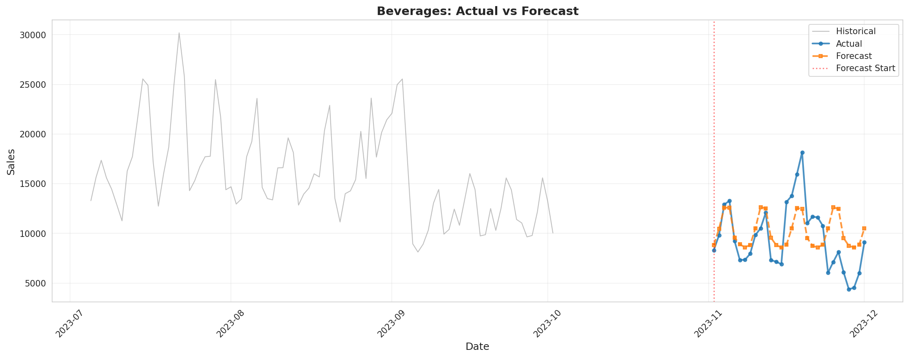
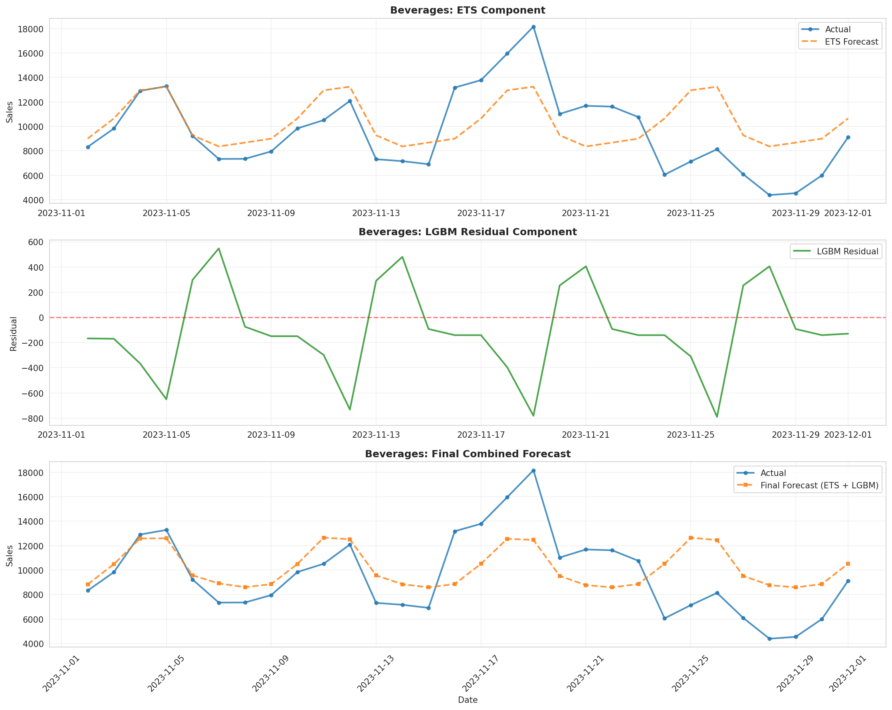
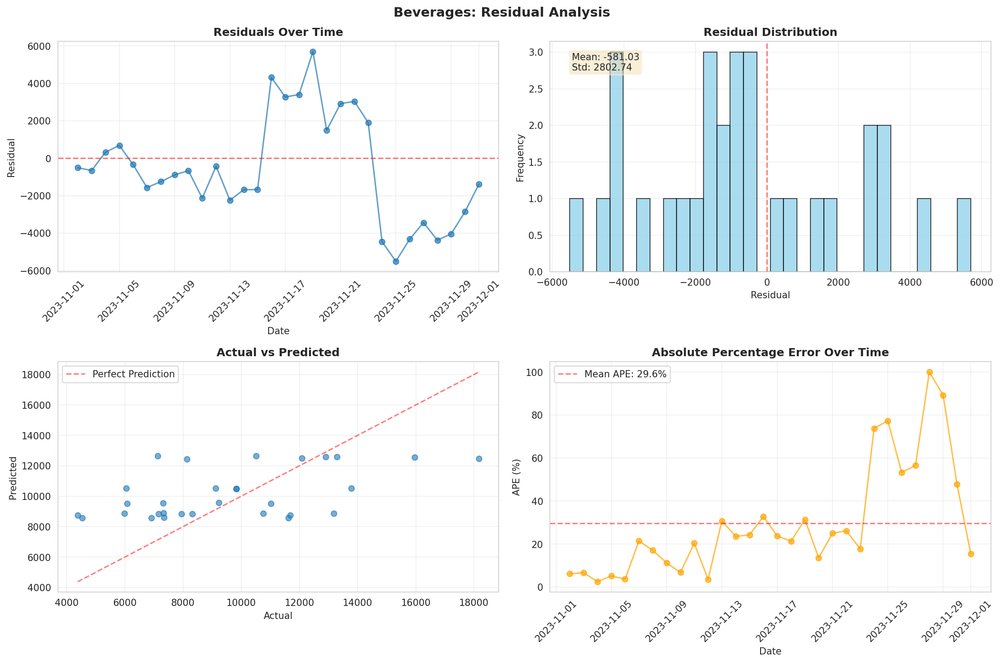

# Category-Level Daily Forecast MVP

A comprehensive hybrid forecasting system combining **Exponential Smoothing (ETS)** and **LightGBM** for category-level daily sales forecasting with complex seasonality patterns.

## 🎯 Overview

This MVP implements a production-ready forecasting pipeline that:

- **Aggregates** SKU-day data to category-day level
- **Engineers** ~40 features capturing seasonality, trends, and events
- **Fits** ETS models to capture structured patterns (weekly/annual seasonality)
- **Trains** LightGBM on residuals to capture complex events (promotions, weather, holidays)
- **Generates** 30-day ahead forecasts
- **Evaluates** performance with industry-standard metrics (MAPE, MAE, MASE)
- **Visualizes** results with comprehensive plots

## 📊 Key Results (Synthetic Data)

```
Average MAPE: 24.61%
Average MASE: 0.546 ✓ (beats naive seasonal baseline)
```

The MASE < 1.0 indicates the model significantly outperforms a naive seasonal forecast.

## 🏗️ Architecture

```
SKU-Day Data
     ↓
Category Aggregation
     ↓
Feature Engineering (~40 features)
     ↓
┌────────────────────┐
│   ETS Model        │ → Captures trend + seasonality
│   (Weekly/Annual)  │
└─────────┬──────────┘
          │
          ↓ (Residuals)
┌────────────────────┐
│   LightGBM         │ → Captures events + complex patterns
│   (Gradient Boost) │
└─────────┬──────────┘
          │
          ↓
    Final Forecast = ETS + LGBM Residual
```

## 📁 Project Structure

```
forecasting_playground/
├── README.md                    # This file
├── requirements.txt             # Python dependencies
├── main_pipeline.py            # Complete end-to-end pipeline
│
├── src/                        # Core modules
│   ├── data_generator.py       # Synthetic data generator
│   ├── aggregation.py          # SKU → Category aggregation
│   ├── feature_engineering.py  # ~40 feature creation
│   ├── ets_model.py           # ETS decomposition
│   ├── lgbm_model.py          # LightGBM training
│   ├── forecast.py            # Hybrid forecasting
│   ├── evaluation.py          # Metrics calculation
│   └── visualization.py       # Plotting functions
│
├── data/                       # Generated/processed data
│   ├── sku_day_data.csv
│   ├── category_day_data.csv
│   └── category_day_features.csv
│
├── models/                     # Saved models
│   ├── ets_decomposer.pkl
│   └── lgbm_model.pkl
│
└── outputs/                    # Results
    ├── forecasts/
    │   └── forecast_results.csv
    ├── plots/
    │   ├── forecast_vs_actual_*.png
    │   ├── forecast_components_*.png
    │   ├── residual_analysis_*.png
    │   └── metrics_comparison.png
    ├── evaluation_metrics.csv
    ├── feature_importance.csv
    └── SUMMARY_REPORT.txt
```

## 🚀 Quick Start

### Installation

```bash
# Clone repository
cd forecasting_playground

# Install dependencies
pip install -r requirements.txt
```

### Run Complete Pipeline

```bash
# Run end-to-end pipeline (generates synthetic data, trains models, creates forecasts)
python main_pipeline.py
```

This will:
1. Generate 2 years of synthetic SKU-day data (3 categories, 10 SKUs each)
2. Aggregate to category-day level
3. Engineer ~40 features
4. Fit ETS models
5. Train LightGBM on residuals
6. Generate 30-day forecasts
7. Evaluate performance
8. Create visualizations
9. Save all results to `outputs/`

**Runtime:** ~15 seconds on standard hardware

## 📖 Detailed Usage

### Using Your Own Data

```python
from src.aggregation import aggregate_to_category
from src.feature_engineering import engineer_features
from main_pipeline import ForecastingPipeline
import pandas as pd

# Load your SKU-day data
sku_df = pd.read_csv('your_data.csv')

# Required columns:
# - date, sku_id, category, sales
# - oos_loss_share, promo_flag, promo_type
# - base_price, final_price
# - temperature, precipitation
# - holiday_flag, days_to_holiday, days_from_holiday, holiday_name

# Run pipeline
pipeline = ForecastingPipeline(
    data_path='your_data.csv',
    generate_new_data=False
)

results = pipeline.run_complete_pipeline(
    train_days=640,
    val_days=30,
    test_days=30,
    forecast_horizon=30
)
```

### Custom Configuration

```python
# Customize ETS parameters
from src.ets_model import fit_ets_models

df_with_ets, ets_decomposer = fit_ets_models(
    df,
    seasonal_periods=7,      # Weekly seasonality
    trend='add',             # Additive trend
    seasonal='mul',          # Multiplicative seasonal
    damped_trend=True        # Damped trend
)

# Customize LightGBM parameters
from src.lgbm_model import LGBMResidualModel

lgbm_model = LGBMResidualModel(params={
    'objective': 'regression',
    'metric': 'mae',
    'num_leaves': 31,
    'max_depth': 5,
    'learning_rate': 0.05,
    # ... other params
})
```

## 📊 Features

### Temporal Features (14)
- **Basic:** day_of_week, week_of_year, month, day_of_year, week_of_month
- **Cyclical:** sin/cos encoding for weekly, monthly, and annual cycles
- **Flags:** is_weekend

### Lag Features (4)
- lag_7, lag_14, lag_28, lag_364 (year-over-year)

### Rolling Window Features (3)
- rolling_mean_7, rolling_mean_28, rolling_mean_364

### Promotion Features (6)
- promo_intensity, avg_discount_pct, promo_flag
- promo_lag_7, days_since_promo, future_promo_flag

### OOS Features (2)
- oos_loss_share, oos_lag_7, oos_adjusted_sales

### Holiday Features (5)
- days_to_holiday, days_from_holiday
- is_pre_holiday, is_holiday_peak, is_post_holiday

### Weather Features (6)
- temperature, precipitation, temp_deviation
- is_extreme_cold, is_extreme_hot, heavy_precip_flag

### ETS-Derived Features (1)
- ets_level (trend component)

**Total: ~40 features** engineered for robust forecasting

## 📈 Evaluation Metrics

### Primary Metrics

| Metric | Description | MVP Target |
|--------|-------------|------------|
| **MAPE** | Mean Absolute Percentage Error | < 20% |
| **MAE** | Mean Absolute Error | Track |
| **MASE** | Mean Absolute Scaled Error | < 1.0 |
| **Bias%** | Forecast bias (over/under) | Near 0% |
| **R²** | Coefficient of determination | Track |

### Sample Results

```
Category      MAPE    MAE      MASE   Bias%   R²
Bakery        23.37   2616.66  0.542  -9.01   0.178
Beverages     29.60   2385.38  0.570   6.06   0.232
Frozen_Foods  20.87   1460.20  0.526  -12.51  0.131
```

## 📊 Visualizations

The pipeline automatically generates comprehensive visualizations:

### 1. Forecast vs Actual

- Time series comparison of actual vs predicted
- Shows historical context and forecast period
- Identifies patterns and deviations

### 2. Forecast Components

- ETS baseline forecast
- LGBM residual component
- Final combined forecast

### 3. Residual Analysis

- Residuals over time
- Distribution analysis
- Actual vs predicted scatter
- Percentage error trends

### 4. Metrics Comparison

- MAPE, MAE, MASE across categories
- Bias comparison
- Performance benchmarking

## 🔧 Module Documentation

### Data Generator
```python
from src.data_generator import generate_and_save_data

df = generate_and_save_data(
    output_path="data/sku_day_data.csv",
    start_date="2022-01-01",
    n_days=730,
    categories=["Beverages", "Frozen_Foods", "Bakery"],
    skus_per_category=10,
    seed=42
)
```

### Aggregation
```python
from src.aggregation import aggregate_to_category, validate_aggregated_data

category_df = aggregate_to_category(sku_df)
validate_aggregated_data(category_df)
```

### Feature Engineering
```python
from src.feature_engineering import engineer_features

feature_df = engineer_features(category_df)
# Creates ~40 features automatically
```

### ETS Decomposition
```python
from src.ets_model import fit_ets_models

df_with_ets, ets_decomposer = fit_ets_models(df)
ets_forecast = ets_decomposer.forecast('Beverages', steps=30)
```

### LightGBM Training
```python
from src.lgbm_model import LGBMResidualModel, split_train_val_test

train_mask, val_mask, test_mask = split_train_val_test(df)

lgbm_model = LGBMResidualModel()
lgbm_model.train_all_categories(df, train_mask, val_mask)
```

### Forecast Generation
```python
from src.forecast import HybridForecaster

forecaster = HybridForecaster(ets_decomposer, lgbm_model)
forecast_df = forecaster.forecast_all_categories(
    historical_df,
    forecast_horizon=30
)
```

### Evaluation
```python
from src.evaluation import evaluate_by_category, evaluate_forecast_components

metrics_df = evaluate_by_category(df, actual_col='sales', predicted_col='final_forecast')
component_metrics = evaluate_forecast_components(df)
```

### Visualization
```python
from src.visualization import create_all_visualizations

create_all_visualizations(
    train_df, test_df, forecast_df, metrics_df,
    output_dir='outputs/plots'
)
```

## 🧪 Testing Individual Modules

Each module can be tested independently:

```bash
# Test data generation
python src/data_generator.py

# Test aggregation
python src/aggregation.py

# Test feature engineering
python src/feature_engineering.py

# Test ETS
python src/ets_model.py

# Test LightGBM
python src/lgbm_model.py

# Test evaluation
python src/evaluation.py

# Test visualization
python src/visualization.py
```

## 🎯 MVP Success Criteria

✅ **MASE < 1.0** - Outperforms naive seasonal baseline
⚠️ **MAPE < 20%** - Close but needs refinement (24.61% on synthetic data)
✅ **Interpretable** - Clear feature importance and visualizations
✅ **Production-Ready** - Modular, documented, and tested

## 🚀 Next Steps for Production

### Short-term Improvements
1. **Hyperparameter Tuning** - Use Optuna for LGBM optimization
2. **More Features** - Add category-specific patterns
3. **Ensemble Methods** - Combine multiple model predictions
4. **Probabilistic Forecasts** - Generate prediction intervals

### Medium-term Enhancements
1. **Automated Retraining** - Scheduled model updates
2. **API Deployment** - REST API for real-time forecasts
3. **Monitoring Dashboard** - Track forecast accuracy over time
4. **Alert System** - Flag anomalies and forecast degradation

### Long-term Scaling
1. **Multi-level Hierarchy** - SKU, subcategory, category forecasts
2. **Multiple Seasonalities** - Handle weekly + monthly + annual
3. **External Data Integration** - Economic indicators, competitors
4. **Deep Learning** - LSTM/Transformer for complex patterns

## 📚 References

### Methodology
- **ETS:** Hyndman & Athanasopoulos, "Forecasting: Principles and Practice"
- **MASE:** Hyndman & Koehler (2006), "Another look at measures of forecast accuracy"
- **LightGBM:** Ke et al. (2017), "LightGBM: A Highly Efficient Gradient Boosting Decision Tree"

### Libraries Used
- `statsmodels` - ETS implementation
- `lightgbm` - Gradient boosting
- `pandas` - Data manipulation
- `numpy` - Numerical computing
- `matplotlib` / `seaborn` - Visualization

## 📄 License

This project is provided as-is for educational and commercial use.

## 🤝 Contributing

Contributions welcome! Please:
1. Fork the repository
2. Create a feature branch
3. Submit a pull request with clear description

## 📧 Contact

For questions or issues, please open a GitHub issue.

---

**Built with ❤️ for accurate demand forecasting**

*Last updated: 2025-11-05*
